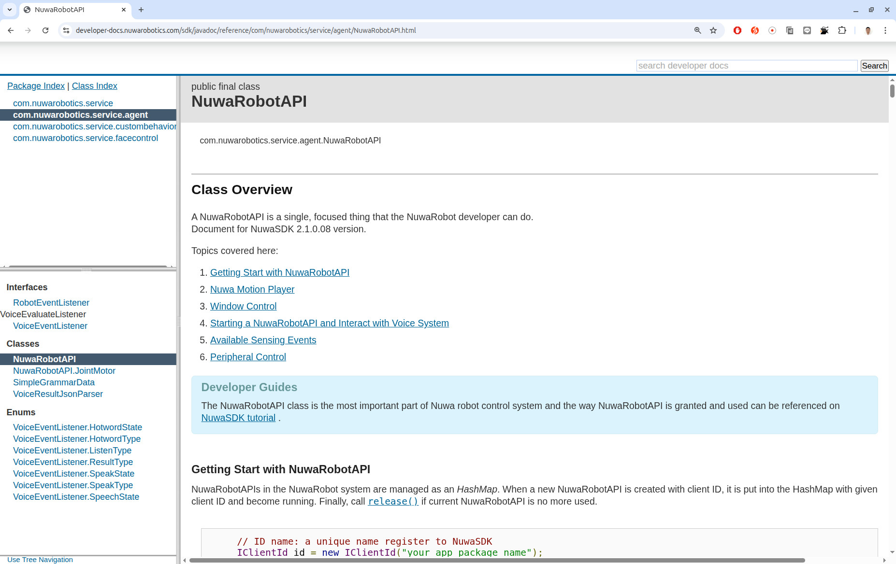
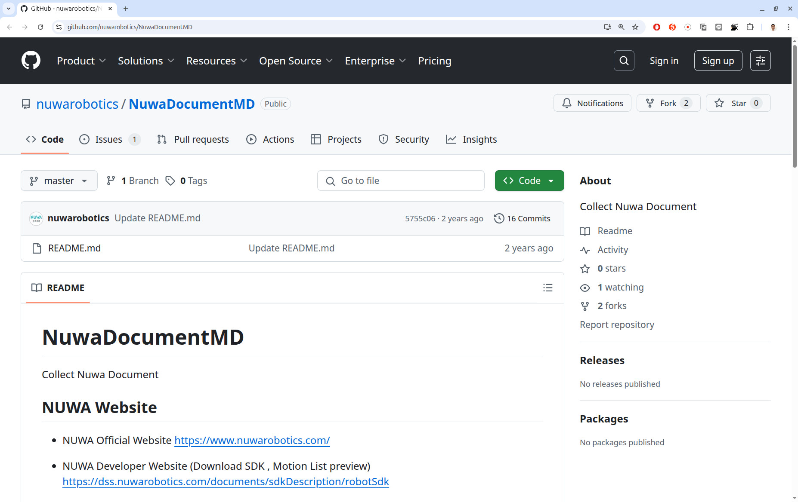
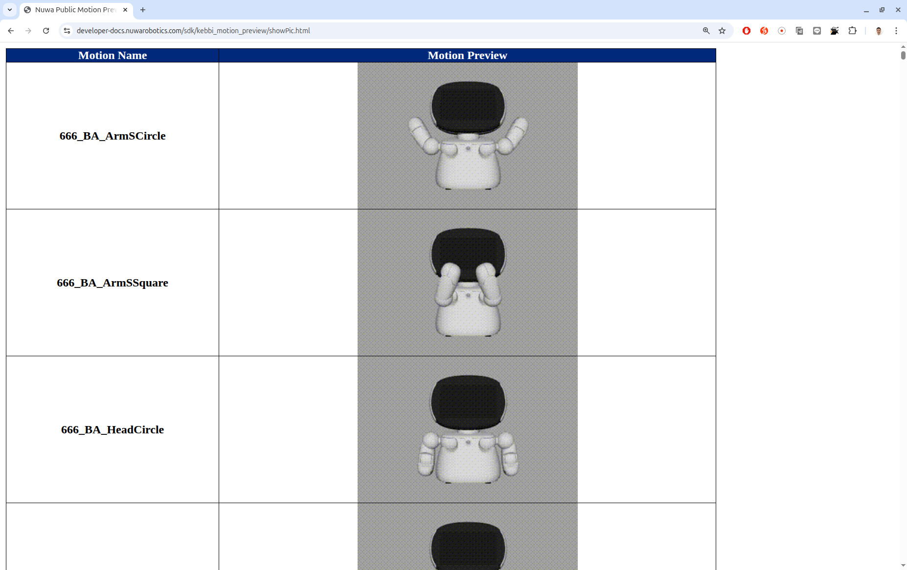
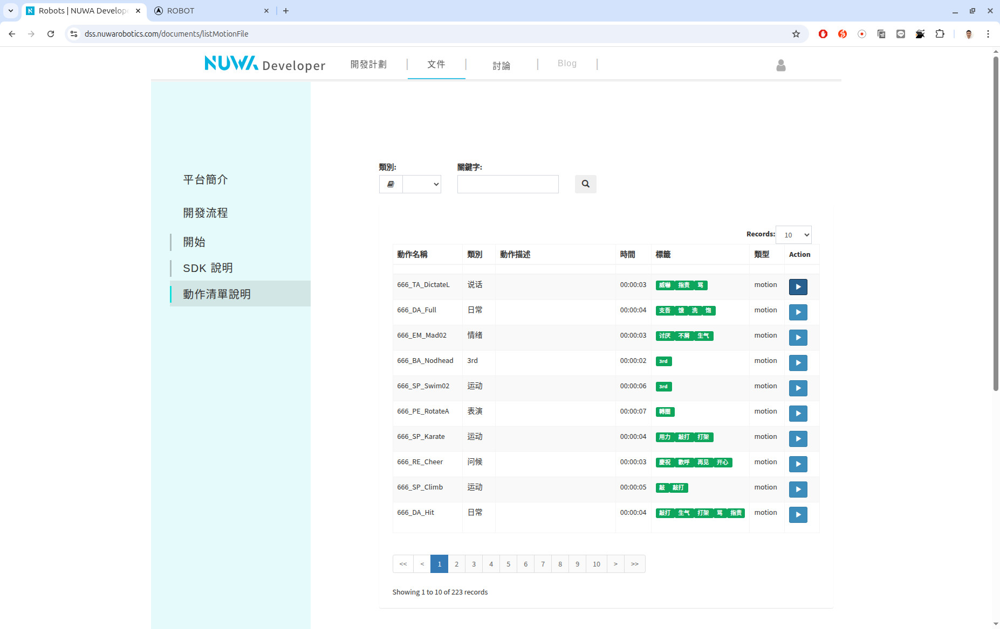
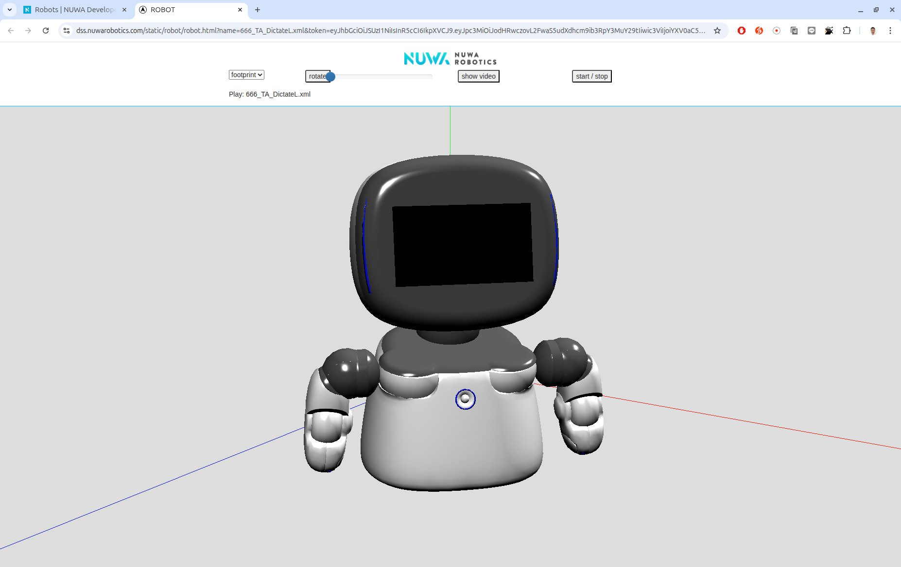

This folder contains the source files to build a robot-side app for the Kebbi Air-S robot.


# Developing Tool
Android Studio Meerkat | 2024.3.1 Patch 2

# Platform
Ubuntu 24.04

# Build
Just use Android Studio to open this directory and the gradle will automatically build this project.

# Installation
There are two ways to install our app onto a Kebbi robot.
The better way is to install our app through a USB cable connection from the PC to the robot. The benefit is that you can easily debug.

To enable this feature, you need the privilege of Ubuntu's plugdev group.
Use this command to check whether your account is in the group already.
```sh
cat /etc/group | grep plugdev
```
If you can find your user name, your account is already in the group.
Otherwise, use this command to add your account into the group and install a package
```sh
sudo usermod -aG plugdev $LOGNAME
sudo apt-get install android-sdk-platform-tools-common
```
You need to log out and log in to activate your new group privilege.

On the Kebbi robot, you need to enable its USB debugging mode.
Kebbi's OS is Android 9, and you need to click "About Kebbi" (關於凱比) 10 times to turn on the Android developer mode.
When the Android developer mode is available, go to the "Developer Options" and enable the "USB debugging".
After connecting to PC, you will see a dialog window to confirm your intention to connect this Android device to this PC. Here, you need to key in the ADB (Android Debug Bridge) password !Q@W#E$R to ensure this step.

There is another way to install our app through an APK file. From the Android Studio, create an APK and manually copy the APK file to a micro SD card. Insert the micro SD card into Kebbi's head socket, which is hided by a rectangle plastic lid. Launch Kebbi's file manager to open the APK file and install our app.

# Kebbi SDK



Kebbi's SDK is online available at Nuwa robotics' website [Link](https://developer-docs.nuwarobotics.com/sdk/javadoc/reference/com/nuwarobotics/service/agent/NuwaRobotAPI.html). We use the version 2.1.0.08.

# Nuwa Robotics Docuemnts



There is a GitHub web page provided by the Nuwa robotics [Link](https://github.com/nuwarobotics/NuwaDocumentMD), which can be viewed as an entrance of associated documents. However, this page is not well maintained. Some links do not work.

# Kebbi's motion preview



There are 223 built-in motions (Kebbi's body actions) available. To quickly go through all of them, Nuwa robotics provides a page showing their GIF animations [Link](https://developer-docs.nuwarobotics.com/sdk/kebbi_motion_preview/showPic.html).

If you want to view those motions in 3D, Nuwa robotics provides another page for this purpose.



However, you need to have a Nuwa developer account and first and log in their developer website and then you can browse those motions.
[Link](https://dss.nuwarobotics.com/documents/listMotionFile) In addition, the only language supported by this page is Chinese, which is inconvenient for non-Chinese developers.


