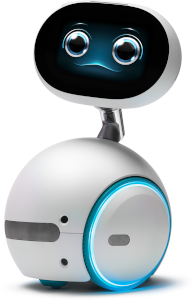
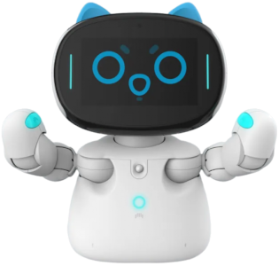
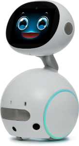
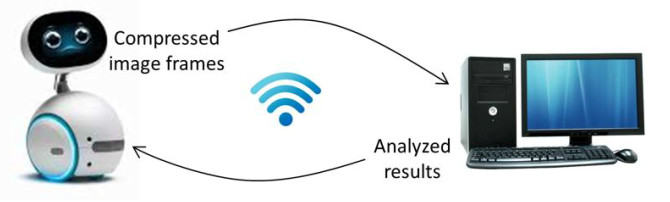

#### Introduction
This is a project for developing a companion robot to help nurses in hospitals. There is a shortage of nurses in Taiwan, due to several factors such as low salaries, unsatisfying working environment, and the reduction of young working labors in the population structure caused by sub-replacement fertility.

#### Robot Models
We develop our programs on three types of robots: Zenbo, Kebbi, and Zenbo Jr. II.

|Model| Zenbo | Kebbi Air-S | Zenbo Junior II |
|:----| :----:| :----: | :----: |
|image|   |  |  |
|OS   | Android 6 | Android 9 | Android 10 |
|Manufactor| Asus | NuwaRobotics| Asus|

#### Goal
We want to develop a few features of the robot.
- Talk to the patient as a companion and reduce his/her stress and anxiety.
- Monitor the patient and notify the corresponding nurse in case when some events occur.

#### Technical Plan

Because Zenbo's computational power is weak, we plan to utilize Wi-Fi to transmit video and audio data to a server, which is powerful enough to take tasks of vision and voice recognition, and natural language processing. The robot will receive commands or analyzed results from the server and then interact with a child patient.