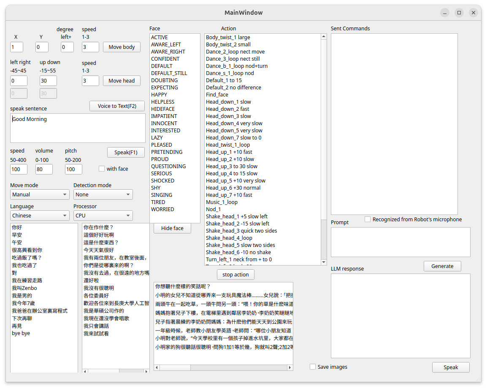

This folder contains the code files for the server side program of ZenboNurseHelper. It provides an Graphic User Interface (GUI) for a user to remotely control the robot's action. The GUI currently looks like the image below and allows a user to send commands to the robot-side's app, which calls Zenbo SDK to execute those commands.



In this project, we utilize MediaPipe as the pose estimation library to guide our Zenbo robot. Our server-side program receives frames transmitted from the robot-side app, estimates human pose landmark coordinates, send commands to robot to call robot's movement APIs.

# Install
We create a script file to install our code and all required libraries MediaPipe, OpenCV, git, gcc, Protocol Buffer, Qt, and PortAudio.
The easiest way to install our program is to execute the following script.
```sh
cd ~
wget -O install.sh https://raw.githubusercontent.com/yangchihyuan/ZenboNurseHelper/refs/heads/master/Server/install.sh
chmod +x install.sh
./install.sh
```

It will ask for your sudo password and take 40 to 50 minutes to install libraries
and compile files. When everything is ready, you can use the following command to launch our program.

If your PC does not have a NVidia GPU of the RTX 30 or 40 serial, you can lanuch the program by
```sh
./run_server_side_program.sh
```
which will load the small whipser base model, and it is still affordable by a CPU.
If your PC is equipped with a RTX 30 or 40 serial GPU, use this command
```sh
./run_server_side_program.sh turbo
```
which will load the ggml-large-v3-turbo model to recognize your voice very fast.

# Known problems and workarounds
You cannot install the pre-built OpenCV and Protocol Buffer packages for Ubuntu 24.04. The pre-built OpenCV 4.6.0 conflicts with MediaPipe's dependent OpenCV version in terms of their included Protocol Buffer version.
