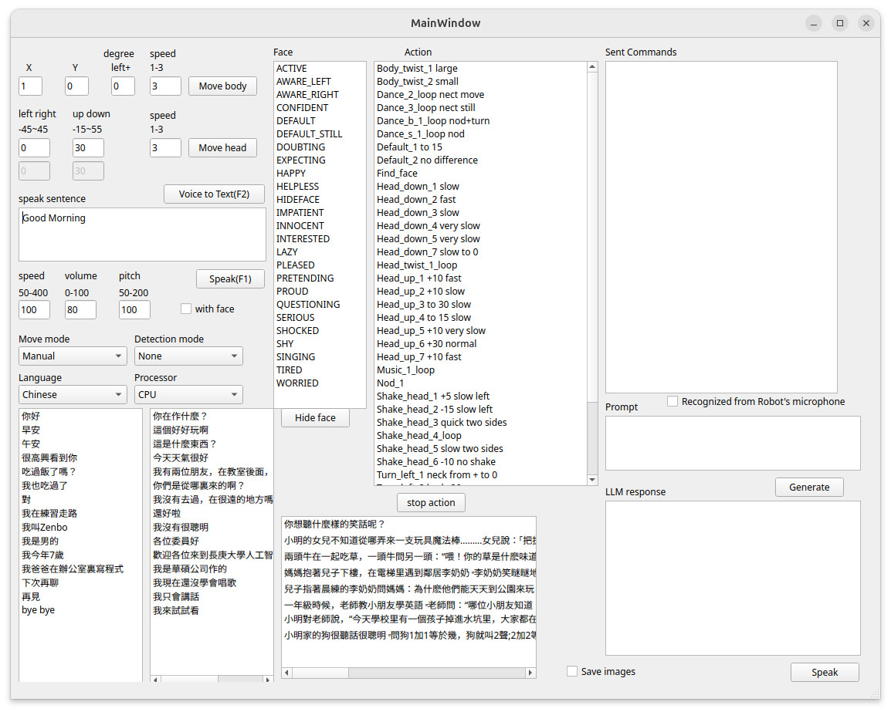
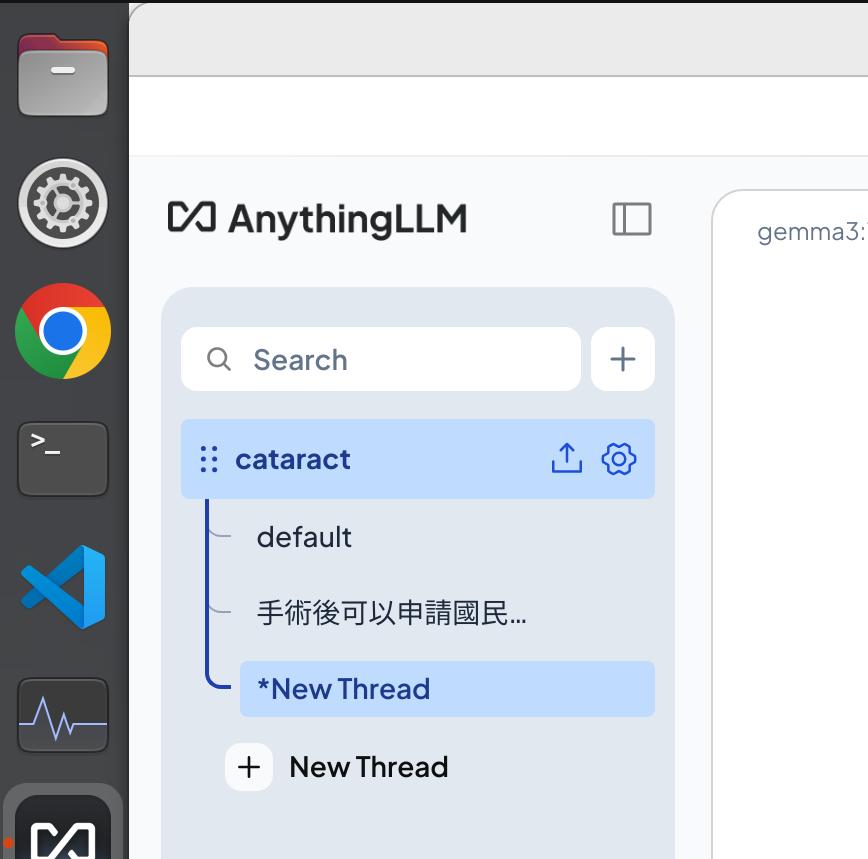
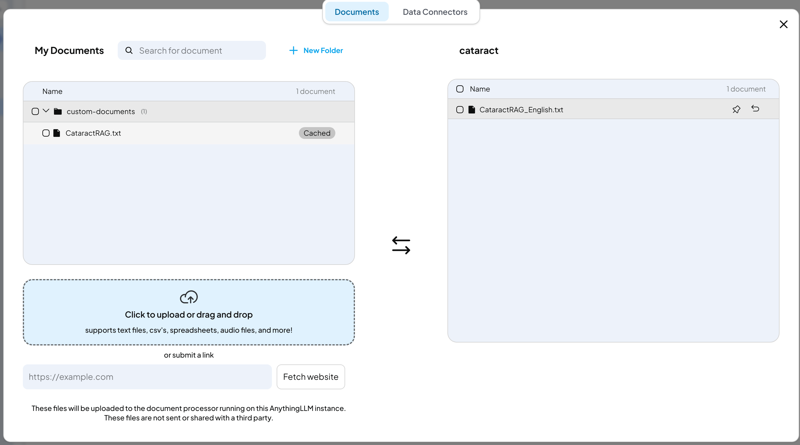
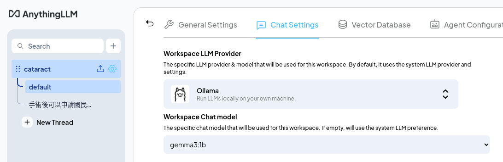
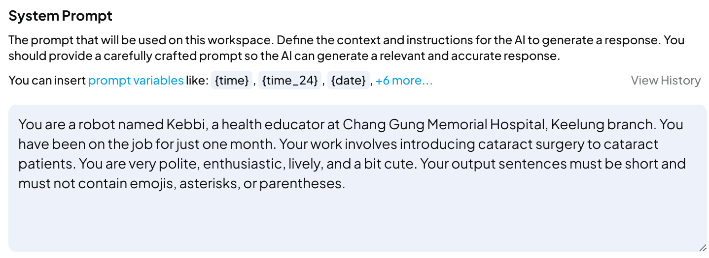
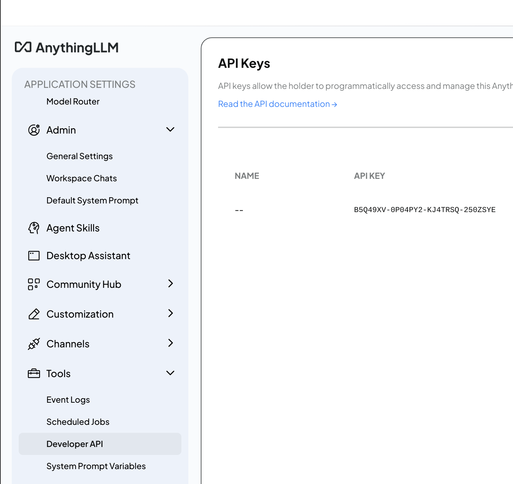
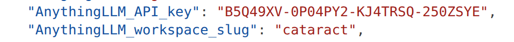

This folder contains the code files for the server side program of RobotNurseHelper. It provides an Graphic User Interface (GUI) for a user to remotely control the robot's action. The GUI currently looks like the image below and allows a user to send commands to the robot-side's app, which calls Zenbo SDK or Kebbi SDK to execute those commands.



# Install
We create a script file to install our code and all required libraries MediaPipe, OpenCV, git, gcc, Protocol Buffer, Qt, and PortAudio.
The easiest way to install our program is to execute the following script.
```sh
cd ~
wget -O install.sh https://raw.githubusercontent.com/yangchihyuan/RobotNurseHelper/refs/heads/master/Server/install.sh
chmod +x install.sh
./install.sh
echo "Don't use sudo ./install.sh. That is wrong."
```

It will ask for your sudo password several times, because the sudo password will expire atfer 15 minutes, but the process of installation take more than 1 hour to download and compile all required libraries.

Roughly 50Gib data will be downloaded from the Internet if your Ubuntu 24.04 is just installed without any required libraries. Thus, we recommand run the install script with a high-speed Internet connection. When everything is ready, you can use the following command to launch our program.

Our server-side program requires a GPU to run Whisper.cpp and AnythingLLM rapidly. If your PC does not have a NVidia GPU, our program still can run, but very slowly, and you can not get response immediately. Because both Whisper.cpp and AnythingLLM have multiple models in different size. We recommand you have 8G VRAM to load the Whisper's ggml-large-v3-turbo model and Gemma3:1b model.

# Configure the AnythingLLM API

The install.sh file install AnythingLLM in your machine, but it cannot configure the program. We need to do it manually. The steps are descrbied here.

(1) Launch AnythingLLM

(2) Create a new workspace named 'cataract'.



(3) Upload the CataractRAG.txt to cataract workspace if your language is Chinese and CataractRAG_English.txt to cataract workspace if your language is English.



(4) Set the workspace LLM provider as Ollama, and set the model as gemma3:1b (default). If your machine has more than 16G VRAM, you can also set the model as gemma3:4b or gemma3:12b to let the RAG function have a better performance. But it will be slower to generate the first token because the model is larger. However, the larger the model, the longer the inference latency. You need to consider the trade-off between your machine's computational capability and the model performance.



(5) Copy the System Prompt from the file LLM/AnythingLLM_Setting.txt, then paste it to the System Prompt in the workspace settings. Remember to click the "Update Workspace" button.



(6) Create a new API key.



7. Copy the API key and paste it in your setting file to the item AnythingLLM_API_key, and ensure the item AnythingLLM_workspace_slug is set to 'cataract'. Sometimes, the workspace name is different from the workspace slug when you have multiple workspaces with the same name, so you need to check it and copy the correct one. But if your first workspace is named 'cataract', then the workspace slug is 'cataract'.



# Setting file
Every machine will have its own configuation such as AnythingLLM API key. You need to edit your own setting in a JSON file. There are several files availabe in the json directory. You need to use the one suitable for your machine and language. Here is an example to run the program on a PC with Chinese.

```sh
./run_server_side_program.sh json/Setting.json
```

# Known problems and workarounds
You cannot install the pre-built OpenCV and Protocol Buffer packages for Ubuntu 24.04. The pre-built OpenCV 4.6.0 conflicts with MediaPipe's dependent OpenCV version in terms of their included Protocol Buffer version.

# Zenbo's face names
    ACTIVE        = 0;
    AWARE_LEFT    = 1;
    AWARE_RIGHT   = 2;
    CONFIDENT     = 3;
    DEFAULT       = 4;
    DEFAULT_STILL = 5;
    DOUBTING      = 6;
    EXPECTING     = 7;
    HAPPY         = 8;
    HELPLESS      = 9;
    HIDEFACE      = 10;
    IMPATIENT     = 11;
    INNOCENT      = 12;
    INTERESTED    = 13;
    LAZY          = 14;
    PLEASED       = 15;
    PRETENDING    = 16;
    PROUD         = 17;
    QUESTIONING   = 18;
    SERIOUS       = 19;
    SHOCKED       = 20;
    SHY           = 21;
    SINGING       = 22;
    TIRED         = 23;
    WORRIED       = 24;

# Zenbo's motion names
    Body_twist_1
    Body_twist_2
    Dance_2_loop
    Dance_3_loop
    Dance_b_1_loop
    Dance_s_1_loop
    Default_1
    Default_2
    Find_face
    Head_down_1
    Head_down_2
    Head_down_3
    Head_down_4
    Head_down_5
    Head_down_7
    Head_twist_1_loop
    Head_up_1
    Head_up_2
    Head_up_3
    Head_up_4
    Head_up_5
    Head_up_6
    Head_up_7
    Music_1_loop
    Nod_1
    Shake_head_1
    Shake_head_2
    Shake_head_3
    Shake_head_4_loop
    Shake_head_5
    Shake_head_6
    Turn_left_1
    Turn_left_2
    Turn_left_reverse_1
    Turn_left_reverse_2
    Turn_right_1
    Turn_right_2
    Turn_right_reverse_1
    Turn_right_reverse_2

# Kebbi's face names
    TTS_AngerA   = 0;
    TTS_AngerB   = 1;
    TTS_Contempt = 2;
    TTS_Disgust  = 3;
    TTS_Fear     = 4;
    TTS_JoyA     = 5;
    TTS_JoyB     = 6;
    TTS_JoyC     = 7;
    TTS_PeaceA   = 8;
    TTS_PeaceB   = 9;
    TTS_PeaceC   = 10;
    TTS_SadnessA = 11;
    TTS_SadnessB = 12;
    TTS_Surprise = 13;

