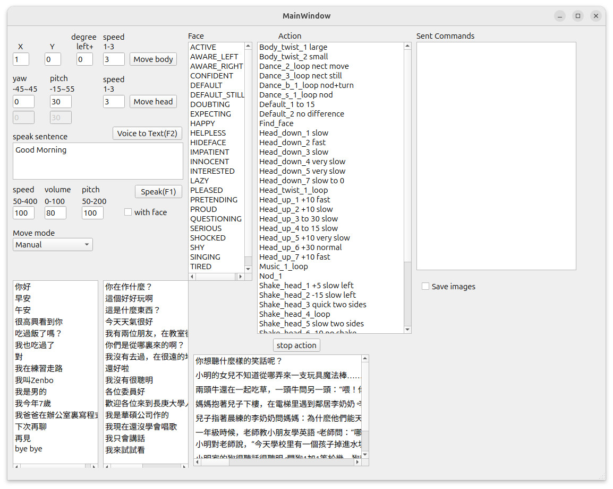

This folder contains the code files for the server side program of ZenboNurseHelper. It provides an Graphic User Interface (GUI) for a user to remotely control the robot's action. The GUI currently looks like the image below and allows a user to send commands to the robot-side's app, which calls Zenbo SDK to execute those commands.



In this project, we utilize MediaPipe as the pose estimation library to guide our Zenbo robot. Our server-side program receives frames transmitted from the robot-side app, estimates human pose landmark coordinates, send commands to robot to call robot's movement APIs.

# Install
We create a script file to install our code and all required libraries MediaPipe, OpenCV, git, gcc, Protocol Buffer, Qt, and PortAudio.
The easiest way to install our program is to execute the following script.
```sh
cd ~
wget -O install.sh https://raw.githubusercontent.com/yangchihyuan/ZenboNurseHelper/refs/heads/master/cpp2/install.sh
chmod +x install.sh
./install.sh
```

It will ask for your sudo password and take 20 to 30 minutes to install libraries
and compile files. When everything is ready, you can use the following command to launch our program.

```sh
./run_server_side_program.sh
```
The program easily crashes because we use several libraries containing bugs. To detect those bugs, use this command
```sh
./run_server_side_program.sh debug
```
which use gdb for debugging.

# Known problems and workarounds
You cannot install the pre-built OpenCV and Protocol Buffer packages for Ubuntu 24.04. The pre-built OpenCV 4.6.0 conflicts with MediaPipe's dependent OpenCV version in terms of their included Protocol Buffer version.
